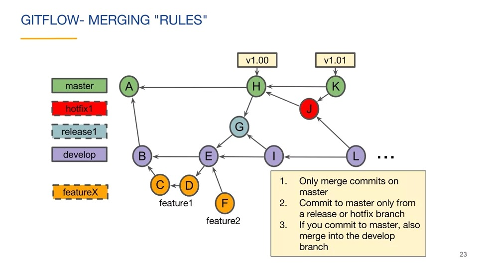

# Version Control with Git

Coursera course: [Link](https://www.coursera.org/learn/version-control-with-git/home/welcome) 

This course covers in depth about the

- [x] Architecture
- [x] References
  - [x] Caret and Tilde Operators
  - [x] The .git Directory
  - [x] Git ID's
  - [x] Git Tags
- [x] Branches
  - [x] Dangling Commits 
  - [x] Detached Head
  - [x] Branch Label
  - [x] Tracking branches
- [x] Merging
  - [x] Fast Forward Merge
  - [x] Merge Commit
  - [x] Merge Conflicts
  - [x] Rebasing
  - [x] Squash Merge
- [x] Pull requests
- [x] Workflows
- [ ] Final Project  

 

## Git Workflow
 

 

## Git cheatsheet

| Command      | Description |
| ----------- | ----------- |
| git reflog  | Returns a local lists of recent HEAD commits |
| git show HEAD^2   | Refers to a second parent of a merge commit |
| git show HEAD^^   | Refers to first parent's parent of a merge commit |
| git merge --no-ff | Avoids a fast forward merge |
| git branch -f (branch-name) (new-commit) | Move branch label to a different commit |
| git remote set-head (remote-url-alias) (branch-name) | Change tracking branch |
| git rebase (upstream-branch) (branch-name) | Rebasing a branch |
| git commit --amend | Amending a commit |
| git merge --squash | Perform a squash merge | 